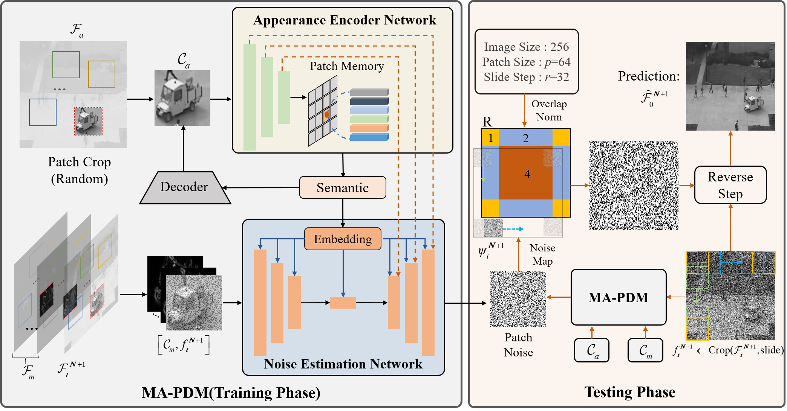

# MA-PDM
This repo contains the Pytorch implementation of our paper:
> [**Video Anomaly Detection with Motion and Appearance Guided Patch Diffusion Model**](https://arxiv.org/abs/2412.09026)
> 
> Hang Zhou, Jiale Cai, Yuteng Ye, Yonghui Feng, Chenxing Gao, Junqing Yu, Zikai Song*, Wei Yang
- **Accepted at AAAI 2025.**  


## Training
All configurations are in the [configs](configs/) folder. All the scripts are located in the [scripts](script/) folder.

## Testing
```
bash test.sh
```
## Citation

If you find this repo useful for your research, please consider citing our paper:

```bibtex
@inproceedings{MAPDM_zh,
  title={Video Anomaly Detection with Motion and Appearance Guided Patch Diffusion Modeln},
  author={Zhou, Hang and Cai, Jiale and Ye, Yuteng and Feng, Yonghui and Gao, Chenxing and Yu, Junqing and Song, Zikai and Yang, Wei},
  booktitle={Proceedings of the AAAI Conference on Artificial Intelligence},
  year={2025}
}
```
---
